<div align="center">

<picture>
  <source media="(prefers-color-scheme: dark)" srcset="docs/assets/sable-mark-dark.svg">
  <source media="(prefers-color-scheme: light)" srcset="docs/assets/sable-mark-light.svg">
  
</picture>

<br>

### The Linux login shell that speaks plain English, shows you every command before it runs, and remembers how your server works.

[](https://github.com/Parthkomalwad/sable/actions/workflows/ci.yml)
[](LICENSE)
[](pyproject.toml)
[](#requirements)
[](ROADMAP.md)
[](#configuration)

[What it solves](#what-it-solves) ·
[Quick start](#quick-start) ·
[See it work](#see-it-work) ·
[How it works](#how-it-works) ·
[Why Sable](#why-sable) ·
[Roadmap](#roadmap) ·
[Docs](docs/README.md)

<br>

<picture>
  <source media="(prefers-color-scheme: dark)" srcset="docs/assets/sable-hero-dark.svg">
  <source media="(prefers-color-scheme: light)" srcset="docs/assets/sable-hero-light.svg">
  
</picture>

</div>

<br>

## What it solves

You know the machine. You do not know the exact `find` invocation, the `journalctl` flag, or which of the four `docker prune` variants is the one that does not eat your volumes. So you leave the terminal, search, and paste back a command you have not fully read — onto production.

Sable removes that round trip **without removing you from the loop.**

<div align="center">

<picture>
  <source media="(prefers-color-scheme: dark)" srcset="docs/assets/sable-problem-dark.svg">
  <source media="(prefers-color-scheme: light)" srcset="docs/assets/sable-problem-light.svg">
  
</picture>

</div>

It is a **login shell**, not a laptop app. It replaces `/bin/bash` on the server, so it sees the real filesystem, the real units, the real logs — and it accumulates knowledge about *that machine*. The tenth deploy is one sentence and zero babysitting.

> **Sable is the shell that asks first.** Nothing runs that you did not see. Anything destructive needs the literal word `YES`. And `scp`, `rsync` and `git push` never touch the agent path at all.

<br>

## Quick start

<table>
<tr>
<td width="50%" valign="top">

**Linux server** (Ubuntu / Debian)

```bash
git clone https://github.com/Parthkomalwad/sable ~/sable
cd ~/sable && bash install.sh
# log out, log in. The wizard picks a backend.
```

`install.sh` creates a venv, registers `sable` in `/etc/shells`, runs `chsh`, creates the audit log and launches the tmux layout. `bash uninstall.sh` puts `/bin/bash` back.

</td>
<td width="50%" valign="top">

**Windows / macOS** (Docker playground)

```powershell
.\scripts\playground.ps1 -Rebuild   # or scripts/playground.sh
```

Full Ubuntu with tmux, `bubblewrap` sandbox and a local `sshd`, source bind-mounted from this repo. Or open the folder in VS Code and choose **Reopen in Container**.

</td>
</tr>
</table>

**No API key?** Two options, both free:

```bash
ollama pull llama3.1            # local model, the default backend
SABLE_MOCK_LLM=1 sable          # canned responses, zero API calls
```

`SABLE_MOCK_LLM=1` swaps in a scripted backend, so routing, the confirm block, sub-agent spawning and `/tour` all work end to end without a key or a local model. Goals it has no script for run one placeholder command and finish, so the loop always terminates. Use it for demos, for the playground, and for trying the shell before committing to a backend.

<br>

## See it work

<details open>
<summary><b>1 · Type bash, get bash. Type English, get a plan.</b></summary>

```text
~/api ❯ git status                         # scored as bash → runs instantly
~/api ❯ show me the biggest files here     # scored as language → agent
  ✦ Listing the 10 largest files in this directory by size
  $ du -ah . | sort -rh | head -n 10
    ↵ run   e edit   q cancel  ›
```

No prefix, no mode switch, no latency tax on the commands you already know. Ambiguous lines ask `[b]ash or [a]gentic?`. Force either way: `>> text` sends to the agent, `Ctrl+B` sends the next line straight to bash, and `/route why "<line>"` explains any routing decision after the fact.
</details>

<details>
<summary><b>2 · Nothing runs without you seeing it. Dangerous things need a YES.</b></summary>

```text
~/api ❯ clean up old docker images and free some disk
  ✦ Removing dangling images and stopped containers
  $ docker system prune -af
    ↵ run   e edit   q cancel  ›  e
    edit> docker system prune -f
  ✓ 0 · 1.8s

~/api ❯ wipe the tmp dir
  ⚠ DESTRUCTIVE  rm -rf /tmp/*
  Type YES to run, anything else to cancel › YES
```

Note the `e`: the model proposed `-af`, the human downgraded it to `-f` and ran that instead. The preview is an edit box, not a dialog.

Eleven destructive patterns (`rm -rf`, `dd`, `mkfs`, `curl | bash`, …) always require the literal word `YES`. The model's own `safe: false` flag is honoured too. Every executed command lands in an append-only audit log.
</details>

<details>
<summary><b>3 · Long work goes to a sub-agent. You keep your prompt.</b></summary>

```text
~/proj ❯ set up a python 3.12 venv, install the requirements and run the test suite
  $ python3.12 -m venv .venv && .venv/bin/pip install -r requirements.txt
    … [timeout after 120s]
  [orchestrator] command timed out, delegating remaining goal to sub-agent
  ◈ spawning agent: set-up-python-venv-20260908 → tmux window task:set-up-python-venv-20260908

~/proj ❯ /task list
  NAME                          STATUS    STEPS  CREATED
  set-up-python-venv-20260908   running   4      2 min ago

~/proj ❯ /task set-up-python-venv-20260908 attach      # jump into its window
~/proj ❯ /task set-up-python-venv-20260908 pause       # SIGTSTP, resume later
```

Sub-agents run in their own tmux window inside a `bwrap` sandbox: their workspace is read-write, everything else read-only. `/task list · attach · pause · resume · kill · inspect · stats · checkpoint · revert`. You can steer a running agent by typing into its window.
</details>

<details>
<summary><b>4 · Do something three times and it becomes a skill.</b></summary>

```text
~/api ❯ /exit
  ✦ 1 new pattern detected in ~/api (build → migrate → restart, seen 3×)
  ✦ crystallised skill: deploy-api  → ~/skills/instructions/deploy-api.md

# next session
~/api ❯ deploy the api
  ✦ Using skill deploy-api            ← matched by keyword, injected into context
```

This is the part a laptop client cannot do: the knowledge is about *this server*, and it is written down where the server can reach it. Skills are plain markdown you can read and edit: `/skill list · new · edit`. Each carries a confidence score that starts at 0.5 when generated and 1.0 when written by hand, and moves +0.05 on success and −0.10 on failure.

Today skills are matched to a goal by keyword. Confidence is recorded but not yet used to rank them, and nothing calls the success and failure nudges automatically; closing that loop is the first item of [Phase 2](docs/roadmap-phases.md).
</details>

<details>
<summary><b>5 · The sidebar and the clipboard.</b></summary>

`Ctrl+T` toggles a live sidebar: session and cost, system, git, top processes, 7-day token history, saved snippets, shortcuts. You always know what an agent is doing and what it has cost you — no hidden spend.

Save any command with `/clip add "docker ps -a" --note containers --tags docker`, then run it from the sidebar with arrow keys and Enter, or from the full-screen picker (`/clip`, live filter with `/`).
</details>

<details>
<summary><b>Built-in commands and keys</b></summary>

| Command | | Key | |
|---|---|---|---|
| `/help` | all builtins | `Ctrl+B` | next line is raw bash |
| `/task …` | manage sub-agents | `Ctrl+T` | toggle sidebar |
| `/skill …` | list / new / edit skills | `Ctrl+X` | settings overlay |
| `/clip …` | snippets | `Ctrl+R` | reverse history search |
| `/stats` | 7-day token table | `Tab` | complete command or path |
| `/memory` | view / clear session context | `→` | accept inline suggestion |
| `/config` `/model` `/mode` | settings, backend, routing | `>>` | force agent mode |
| `/route why "<line>"` | why a line routed as it did | `Ctrl+\` | plain bash subshell |
| `/tour` | guided walkthrough | | |
| `/bash` `/plain` | plain bash, `exit` returns | | |
| `/budget reset` `/new` `/exit` | | | |
</details>

<br>

## How it works

Every line you type meets exactly one decision, and the riskiest path is the one that never reaches a model at all.

<div align="center">

<picture>
  <source media="(prefers-color-scheme: dark)" srcset="docs/assets/sable-flow-dark.svg">
  <source media="(prefers-color-scheme: light)" srcset="docs/assets/sable-flow-light.svg">
  
</picture>

</div>

The **SSH bypass is the first executable line of `main.py`**, before any import that could fail. `scp`, `rsync` and `git push` set `SSH_ORIGINAL_COMMAND`, hit that line, and `execvp` straight into bash. They cannot hang on a model, and they cannot be re-interpreted by one.

| Layer | Modules | Notes |
|---|---|---|
| Entry & loop | `app/main.py` `app/repl.py` `agents/router.py` | SSH bypass first; REPL, builtins, routing |
| Execution | `core/executor.py` `policy/engine.py` `agents/planner.py` | everything through a pty; `cd` intercepted in-process; 11-pattern blocklist |
| Agents | `agents/orchestrator.py` `worker.py` `manager.py` `sandbox.py` | multi-turn loop, sub-agents, bwrap with bash-wrapper fallback |
| Skills | `skills/watcher.py` `crystalliser.py` `index.py` | audit-log clustering, LLM-written skills, confidence index |
| Models | `llm/base.py` `ollama.py` `openai.py` `anthropic.py` | one `LLMBackend` ABC, streaming, JSON fallback chain |
| State & UI | `core/db.py` `memory/` `ui/sidebar/` `ui/tmux/` | SQLite WAL, token-reducer compression, sidebar, tmux layout |

Deeper: [docs/architecture-v4.md](docs/architecture-v4.md) (request lifecycle, agent turn, spawn, skills, memory, daemon, processes) · [docs/architecture.md](docs/architecture.md) (v0.3 diagrams) · [docs/specs/prd-v3.md](docs/specs/prd-v3.md) (task engine & skills) · [docs/structure.md](docs/structure.md) (where v4 is going).

<br>

## Why Sable

Most 2026 terminal AI tools are **clients you run on your laptop**. Sable is the **server side**: it lives where the work happens, owns the safety layer, and accumulates knowledge about *that machine*.

| | Sable | Warp / Claude Code / Codex CLI | Aider / Goose |
|---|:-:|:-:|:-:|
| Runs as the login shell on the server | ✅ | ❌ client | ❌ client |
| `scp` / `rsync` / `git push` unaffected (SSH bypass) | ✅ | n/a | n/a |
| Every command previewed, destructive ones gated | ✅ | partial | partial |
| Sub-agents in kernel sandboxes (`bwrap`) | ✅ | cloud or none | none |
| Learns reusable skills from *your* command history | ✅ | manual skills | ❌ |
| Live cost / agent / system sidebar in tmux | ✅ | GUI | ❌ |
| Works fully offline with Ollama | ✅ | ❌ | ✅ |
| Zero LLM gateways, direct `httpx` | ✅ | n/a | n/a |

> **Alpha.** Sable runs as your *login shell*, which is a serious thing to replace. The SSH bypass and `/exit` are bulletproof; the rest is evolving. Read [SECURITY.md](SECURITY.md) before installing on a machine you care about, and keep a second root session open the first time.

<br>

## Roadmap

v4 turns Sable into a full agent runtime. Milestones (full plan with test gates in [ROADMAP.md](ROADMAP.md)):

| | Milestone | What you will notice |
|---|---|---|
| ✅ | v0.1 – v0.3 | shell, safety, three backends, sub-agents, first skills |
| 🔧 | **v0.4 Foundations** | CI, playground, router accuracy, `/tour`, `/bash` to drop to plain Linux and back, clean package layout |
| ⏳ | v0.5 Agent runtime | one `Agent` with roles, event bus, steer with `Ctrl+G`, `/task replay`, repo-aware context |
| ⏳ | v0.6 Skills that learn | confidence-ranked retrieval, skills right after a task, folder skills, learn from your edits |
| ⏳ | v0.7 Policy, trust and tools | `policy.toml` tiers, hooks, output-injection defence, web search, structured file edits, verify-after-act |
| ⏳ | v0.8 Command center | Warp-style blocks, Textual dashboard, approval inbox, ghost-text, explain-last-error |
| ⏳ | v0.9 Autonomy | `sabled` daemon, natural-language cron, approve from your phone |
| ⏳ | v1.0 Ecosystem | MCP client and server, Memory Palace, rehearsal mode, evals, plugins |

<br>

## Configuration

`~/.config/agentic-shell/config.json` (mode 600, moves to `~/.sable/` in v0.4), editable live with `/config` or `Ctrl+X`.

| Key | Default | Meaning |
|---|---|---|
| `backend` | `ollama` | `ollama` · `openai` · `anthropic` |
| `model` | `llama3.1` | model name for that backend |
| `api_base` | `http://localhost:11434` | Ollama URL (ignored for cloud backends) |
| `routing_mode` | `auto` | `auto` heuristic or `prefix` (`>>` only) |
| `daily_token_budget` / `session_token_budget` | `null` | warn at 80 %, hard stop at 100 % |
| `privacy_mode` | `false` | redact keys and high-entropy strings before sending |
| `tasks_base_dir` | `~/tasks` | sub-agent workspaces |

API keys: `OPENAI_API_KEY` / `ANTHROPIC_API_KEY` env vars, or the Linux keyring.

## Requirements

Linux (Ubuntu 22.04+ tested), Python 3.11+, tmux. Optional: `bubblewrap` for kernel-level sandboxing (falls back to a bash wrapper). Ten dependencies, no LLM gateways: see [pyproject.toml](pyproject.toml).

## Contributing

Issues and PRs welcome. Start with [CONTRIBUTING.md](CONTRIBUTING.md) and [docs/branching.md](docs/branching.md); implementation rules are in [CLAUDE.md](CLAUDE.md) and apply to humans and AI sessions alike. Each roadmap feature has an ID (`A1`, `B2` …) you can reference in branches and PRs.

The README artwork is generated: edit the templates in [scripts/assets/](scripts/assets/) and run `python scripts/build-assets.py` to re-render both themes. Never hand-edit `docs/assets/sable-*-{dark,light}.svg` — they are build output, and `--check` fails CI when they drift.

## Documentation

| | |
|---|---|
| [docs/README.md](docs/README.md) | index of everything below |
| [ROADMAP.md](ROADMAP.md) · [docs/roadmap-phases.md](docs/roadmap-phases.md) | milestones, phase gates, playground setup |
| [docs/vision.md](docs/vision.md) | verified current state, research, feature catalog (pillars A to K) |
| [docs/structure.md](docs/structure.md) | target layout, config model, visibility principles |
| [docs/architecture-v4.md](docs/architecture-v4.md) · [docs/architecture.md](docs/architecture.md) · [docs/specs/](docs/specs/) · [docs/plans/](docs/plans/) | architecture, design docs, build plans |
| [CHANGELOG.md](CHANGELOG.md) · [SECURITY.md](SECURITY.md) · [CODE_OF_CONDUCT.md](CODE_OF_CONDUCT.md) | project hygiene |

<br>

<div align="center">

<sub>sable · the shell that asks first</sub>

[MIT](LICENSE) © 2026 Parth Komalwad

</div>
