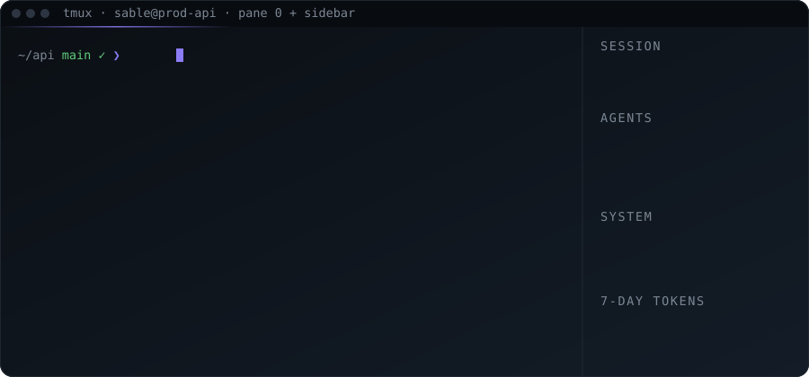

<div align="center">

<picture>
  <source media="(prefers-color-scheme: dark)" srcset="docs/assets/sable-mark-dark.svg">
  <source media="(prefers-color-scheme: light)" srcset="docs/assets/sable-mark-light.svg">
  
</picture>

<br>

### Talk to your server in plain English. Sable runs the work, watches it while you sleep, and pings your phone before anything risky.

[](https://github.com/Parthkomalwad/sable/actions/workflows/ci.yml)
[](LICENSE)
[](pyproject.toml)
[](#quick-start)
[](ROADMAP.md)

**[Documentation](https://claude.ai/artifact/Vr4twSX8dcLQpcusj3RoyS)** ·
[Quick start](#quick-start) ·
[Roadmap](ROADMAP.md) ·
[Contributing](CONTRIBUTING.md)

<br>

<picture>
  <source media="(prefers-color-scheme: dark)" srcset="docs/assets/sable-hero-dark.svg">
  <source media="(prefers-color-scheme: light)" srcset="docs/assets/sable-hero-light.svg">
  
</picture>

</div>

## What it solves

You know the machine. You do not know the exact `find` invocation, the `journalctl` flag, or which `docker prune` keeps your volumes. So you leave the terminal, search, and paste back a command you have not fully read, onto production.

Sable is an AI operator that lives in your server's shell. It replaces `/bin/bash` at login: type bash and it runs; type plain English and it works out the commands, runs the job, and remembers how this machine works. When you log off it keeps going: scheduled jobs, watchers on disk, logs and services, and a push to your phone when something needs you.

> **You stay in command.** Every command it proposes is shown before it runs, anything risky waits for your approval (in the shell, in `/inbox`, or from your phone), and every action lands in an audit log. `scp`, `rsync` and `git push` never touch the model.

- **Works while you're away.** `sabled` runs `/schedule "every night at 2am, back up postgres"` and `/watch` triggers, under the same policy as you.
- **Your phone is the approve button.** ntfy pushes for finished jobs and waiting approvals; tap Approve, single-use and expiring.
- **Previewed and gated.** Every proposed command is an editable preview; eleven destructive patterns need `YES`, and three (`rm -rf /`, a fork bomb, `chmod -R 777 /`) never run.
- **Sandboxed sub-agents.** Long work runs in its own tmux window inside `bwrap`, and you keep your prompt.
- **Skills that learn.** Work you repeat becomes a Markdown skill you approve, ranked by how often it succeeds.
- **No hidden spend.** A live sidebar and `/dash` show cost, running agents and everything waiting on you.
- **Speaks MCP.** Plug in MCP servers with `/mcp add`, or let Claude Code drive the box through `sable --mcp-serve`, behind the same policy and audit.
- **Offline if you want.** Ollama by default; OpenAI and Anthropic over direct `httpx`, no gateway.

## Quick start

**Linux server** (Ubuntu 22.04+ / Debian, Python 3.11+, tmux):

```bash
git clone https://github.com/Parthkomalwad/sable ~/sable
cd ~/sable && bash install.sh     # log out and back in; a wizard picks the backend
```

`bash uninstall.sh` puts `/bin/bash` back.

**Windows / macOS**, in a Docker playground:

```powershell
.\scripts\playground.ps1 -Rebuild   # or: bash scripts/playground.sh
```

**No API key?** `ollama pull llama3.1` for a local model, or `SABLE_MOCK_LLM=1 sable` for scripted replies with no API calls.

> **Alpha.** Sable runs as your login shell, which is a serious thing to replace. Read [SECURITY.md](SECURITY.md) first, and keep a second root session open the first time you install it.

## Documentation

The **[documentation site](https://claude.ai/artifact/Vr4twSX8dcLQpcusj3RoyS)** covers installation, routing, the safety model, sub-agents, skills, every command and key, configuration and architecture.

In this repo: [ROADMAP.md](ROADMAP.md) and [docs/roadmap-phases.md](docs/roadmap-phases.md) for milestones and phase gates, [docs/structure.md](docs/structure.md) for the package layout, [docs/](docs/README.md) for specs and design notes, and [CHANGELOG.md](CHANGELOG.md).

## Contributing

Issues and PRs welcome. Start with [CONTRIBUTING.md](CONTRIBUTING.md) and [docs/branching.md](docs/branching.md); the implementation rules in [CLAUDE.md](CLAUDE.md) apply to people and AI sessions alike.

The README artwork is generated: edit the templates in [scripts/assets/](scripts/assets/) and run `python scripts/build-assets.py`. Never hand-edit `docs/assets/sable-*-{dark,light}.svg`; `--check` fails CI when they drift.

<div align="center">

<sub>sable · your server's AI operator</sub>

[MIT](LICENSE) © 2026 Parth Komalwad

</div>
